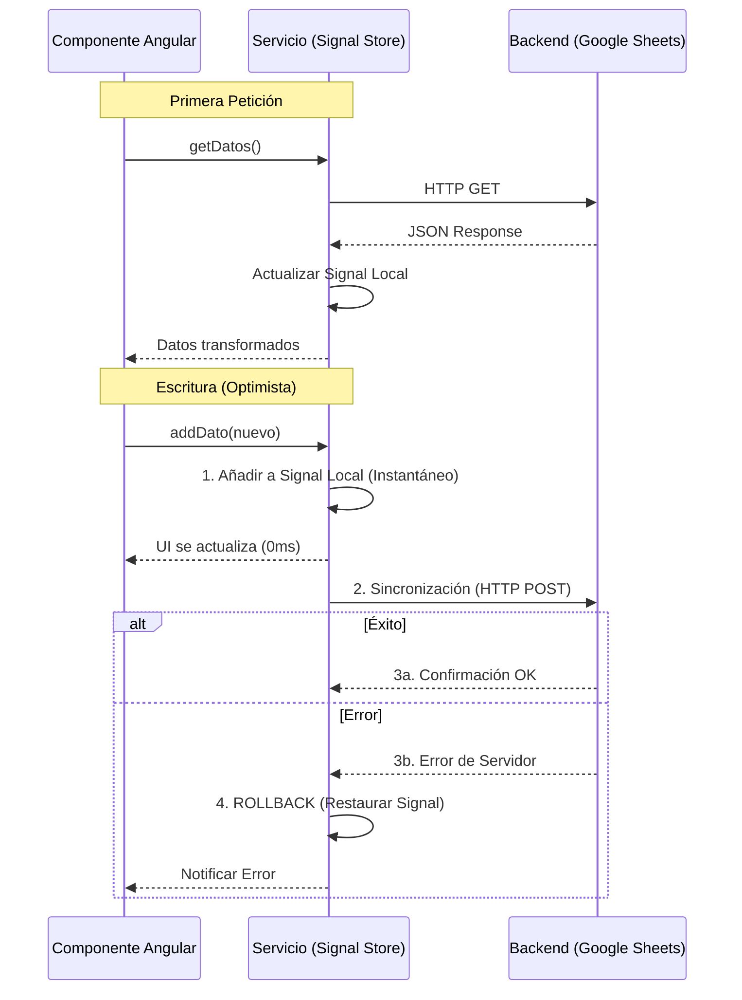

# Documentación Técnica - Pastelería Arruti

## Reglas de Datos

### Identificadores (IDs)
Todos los identificadores únicos (IDs) deben ser generados por el cliente (quien realiza la llamada) utilizando el estándar **UUID (v4)**. La base de datos (Google Sheets) almacenará estos IDs como strings.

## Integraciones: Google Sheets

El sistema utiliza Google Sheets como base de datos centralizada.

### Estructura de "Tablas" (Hojas)

#### Hoja: `Pedidos`
| Columna | Tipo | Descripción |
| :--- | :--- | :--- |
| ID_Pedido | String | Identificador único |
| Producto | String | Nombre del producto artesanal |
| Cantidad | Number | Unidades solicitadas |
| Fecha_Entrega | Date | Fecha comprometida |
| Estado | String | Pendiente, En Proceso, Finalizado |

#### Hoja: `Produccion_Diaria`
| Columna | Tipo | Descripción |
| :--- | :--- | :--- |
| ID_Lote | String | Identificador del lote de producción |
| ID_Pedido | String | Referencia al pedido |
| Hora_Inicio | DateTime | Entrada a producción |
| Fase | String | Preparación, Horno, Decoración |

#### Hoja: `Productos`
| Columna | Tipo | Descripción |
| :--- | :--- | :--- |
| ID_Producto | String | UUID (v4) |
| Familia | String | Categoría (Bollos, Pasteles, etc.) |
| Nombre | String | Nombre comercial |
| Raciones_Tallas | String | Lista separada por comas |

## Contrato de API (Intercambio de Datos)

El middleware (Google Apps Script) expondrá un endpoint GET que devuelve la información en el siguiente formato JSON:

### GET /produccion-diaria
...
```json
{
  "status": "success",
  "data": [
    {
      "id": "PED-001",
      "producto": "Croissant Mantequilla",
      "cantidad": 50,
      "fecha": "2026-01-14",
      "estado_actual": "En Proceso"
    },
    ...
  ],
  "stats": {
    "pendientes": 10,
    "horno": 2,
    "finalizados": 15
  }
}
```

### GET /productos
```json
{
  "status": "success",
  "data": [
    {
      "id_producto": "uuid-1234",
      "familia": "Pastelería",
      "nombre": "Tarta de Queso",
      "raciones_tallas": "4p, 6p, 8p"
    }
  ]
}
```

## Arquitectura de Capas (Angular)

... (existente)

## Interfaz de Usuario y Experiencia (UX/UI)

El sistema está diseñado para ser utilizado principalmente en tablets dentro de la tienda y el obrador.

### Principios de Diseño Tablet-First

1.  **Layout Adaptativo**:
    *   **Móvil/Tablet Vertical**: Listas en formato de "Cards" (tarjetas) para facilitar el scroll vertical y maximizar el área de toque.
    *   **Tablet Horizontal/Desktop**: Tablas compactas o grids de doble columna para aprovechar el ancho de pantalla.
2.  **Objetivos de Toque**:
    *   Botones críticos (Guardar, Entregar, Buscar) tienen un tamaño mínimo de **44x44px** (estándar Apple/Material).
    *   Espaciado generoso entre elementos interactivos para evitar errores de pulsación.
3.  **Jerarquía Visual**:
    *   **Tienda (Creación)**: Doble columna. Izquierda para selección de producto (lo que el cliente pide), Derecha para datos de entrega (cuándo se lo lleva).
    *   **Lista de Pedidos**: Cards con bordes de colores según urgencia (Rojo = Para hoy/Pendiente).

### Tipos de Páginas

| Página | Rol Principal | Optimizaciones Específicas |
| :--- | :--- | :--- |
| **Lista de Pedidos** | Seguimiento y Entrega | Vista rápida de estados, botones de "ENTREGAR" directos, filtros por fecha. |
| **Nuevo Pedido** | Captura de Venta | Buscador predictivo, chips de acceso rápido a familias (Tarta, Pan), selección de hora simplificada. |
| **Obrador Detail** | Producción | Texto de notas ampliado, estados de producción claros, feedback visual de cambios. |

## Optimización de Rendimiento (Estrategia de Caché)

Para mitigar la latencia de Google Apps Script, se implementa un patrón de **Multicasting con Replay** utilizando RxJS en la capa de Servicios.

### Mecanismo: shareReplay(1) y Actualización Optimista

Para mitigar la latencia de Google Apps Script, se combina la caché de lectura con **Actualizaciones Optimistas** gestionadas mediante Angular Signals.



### Reglas de Estado
*   **Signals:** El estado maestro de la aplicación reside en Signals dentro de los servicios.
*   **Invalidación:** La caché se invalida o se revierte automáticamente si la sincronización con el backend falla.
